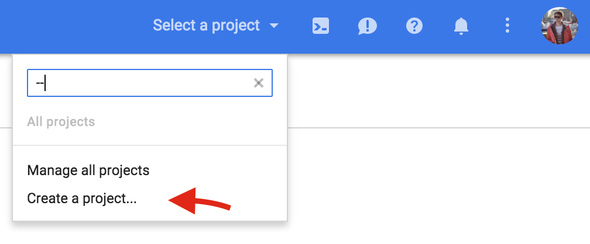
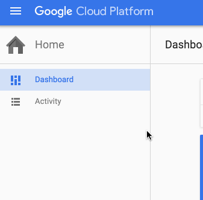
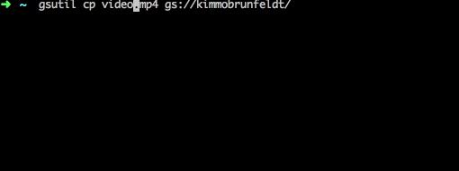

# Google Cloud Storage

[Google Cloud Storage](https://cloud.google.com/storage/) is great for personal
file sharing. In my opinion it's better than S3 for these reasons:

* Daily budget limit
* Official CLI supports object uploads with a nice progress bar feature
* Google Cloud admin UI is simpler than in AWS

Google provides a feature to transfer all data from an S3 bucket
to Google's cloud storage bucket.

After everything is setup, the actual upload to Cloud Storage is a single command:

```bash
gsutil cp my-file.mp4 gs://<bucket-name>/my-file.mp4

# Will be accessible in this URL:
# http://<bucket-name>.storage.googleapis.com/my-file.mp4
```

## How to get started

*You need to have a Google account*

1. Sign in to [Google Cloud Console](https://console.cloud.google.com)
2. Create a billing account in https://console.cloud.google.com/billing
3. Create a new project

    

4. After creating the project, go to Storage console

    

5. Create new bucket, I named my personal bucket as "kimmobrunfeldt"

    The bucket URL will be in this format: http://<bucket-name>.storage.googleapis.com/my-file.mp4

    *Note: this could also be done via gsutil CLI tool*

6. Install `gsutil` https://cloud.google.com/storage/docs/gsutil_install

    This is the Google Cloud Storage CLI tool.

7. Authenticate `gsutil` https://cloud.google.com/storage/docs/gsutil_install#authenticate

    You might want to check Google Cloud IAM users: https://cloud.google.com/storage/docs/iam
    Currently the feature is in Alpha.

8. Set default ACL for new objects in bucket

    I personally want all new objects to be publicly readable by default. That
    can be done with this command:

    ```bash
    gsutil defacl set public-read gs://<bucket-name>
    ```

    See more ACL options in Google's guide https://cloud.google.com/storage/docs/access-control

9. Upload files!

    


### Quick reference

Command                                                    | Description
---------------------------------------------------------- | -------------------------------
`gsutil cp file.mp4 gs://<bucket-name>/`                   | Upload file to bucket root
`gsutil rm gs://<bucket-name>/file.mp4`                    | Remove file in bucket
`gsutil acl set public-read gs://kimmobrunfeldt/file.mp4`  | Set object ACL to public-read
`gsutil defacl set public-read gs://kimmobrunfeldt`        | Set default ACL for new objects
`gsutil acl set private gs://<bucket-name>`                | Set bucket ACL as private
