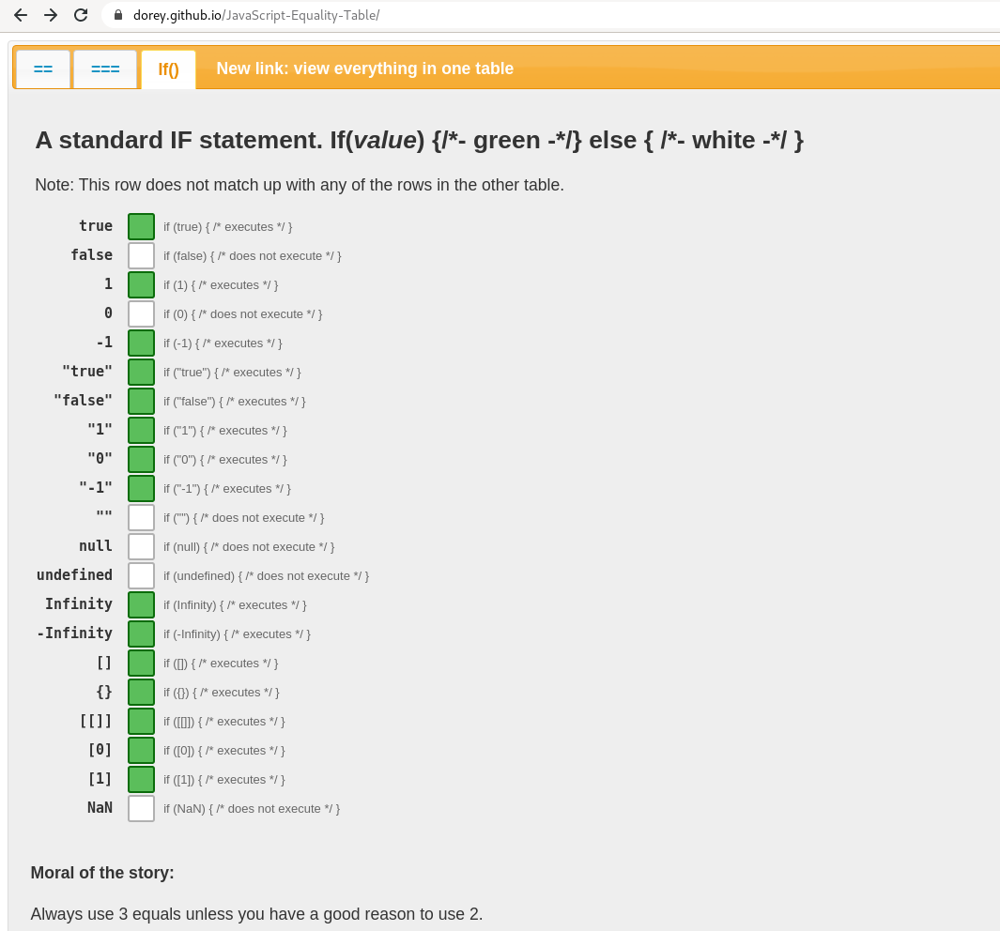

# JavaScript thoughts

Misc thoughts about JS / TS. Some which I quite often explain to many people.

## !!val can be expressed more precisely

When you do `!!val`, here's a list of when it will evaluate as `true` or `false`:

These rules are somewhat simple, but might surprise in many cases. Examples:

* `!!0` -> `false`
* `!!-1` -> `true`
* `!!1` -> `true`
* `!![]` -> `true` *(even though empty)*
* `!!{}` -> `true`
* `!!""` -> `false` *(the string is empty but still falsy, vs array and object)*
* `!!"something" -> `true`

The implicit boolean conversion is probably commonly used because JS doesn't have statically analyzed types, and using `!!` kind of works even when
the type of the value is changed. I'd guess the most common use is to guard against `undefined`, which could be done more explicitly. 
In any case, when writing the implicit boolean conversion it's really hard to make sure all of those different types 
actually convert to the correct boolean values.

Functions almost always has a "hidden" type signature which is in the programmer's head when implementing. To give more
hints about the expected types, I recommend just using explicit checks for everything:

* `_.isFinite(number)`
* `value !== undefined`
* `_.isArray(value) && value.length > 0` 
* `value === null`
* etc.

This communicates the expected type of the values in code better and makes the code more readable.
In case you have a function where value can be multiple types, handle those separately and explicitly with else if. 
The same advice works with TypeScript, since the possible bugs aren't related the static types, but to the surprises 
(to the programmer) in the boolean conversions

If you really need to do implicit boolean conversion, please use `Boolean(value)` since it is more explicit. But I'd recommend avoiding both 
ways of doing implicit conversions if possible.

## Every Number is a floating point number

Yes.

## _.isNumber is almost always incorrect

`_.isNumber(NaN) === true`, what you probably want to do is `_.isFinite(value)`

